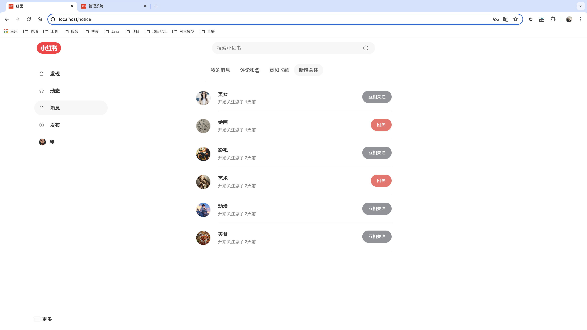
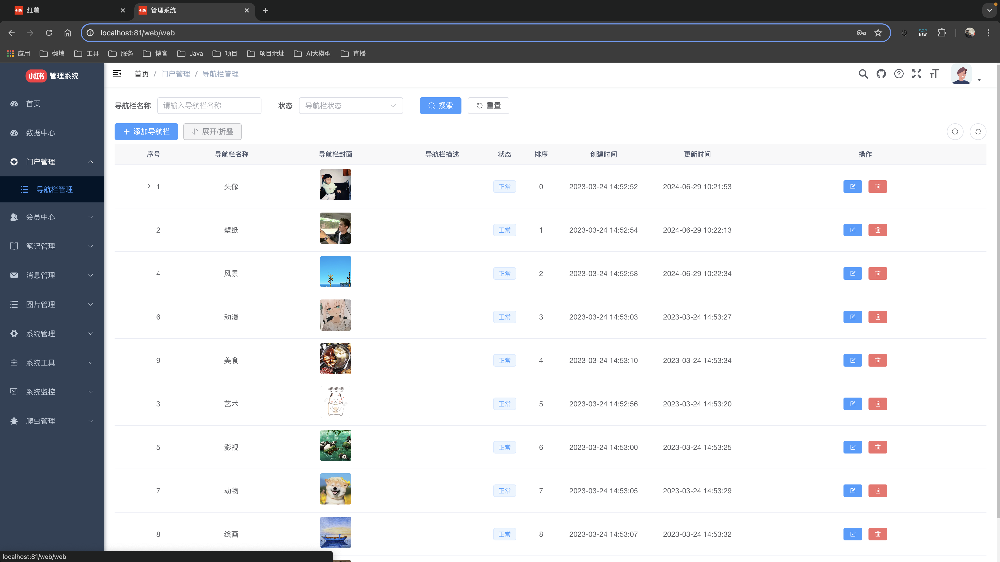

 

<h1 align="center" style="margin: 30px 0 30px; font-weight: bold;">HongShu v1.0</h1>
<h4 align="center">基于 SpringBoot + Vue 前后端分离的仿小红书项目</h4>

	
	
	

## 平台简介
* 本仓库为 uniapp 版本。
* 配套后端代码仓库地址 [HongShu](https://gitee.com/Maverick_Ma/hongshu.git)

## 2.0版本实现功能
1. 添加移动端
2. 重构实现 SpringCloud 微服务架构
3. 加入商城购物功能
4. 加入推荐算法，优化内容推荐和用户推荐功能
5. 使用 MQ+Redis 优化点赞、收藏、浏览功能
6. 支持七牛云、阿里、腾讯、Minio等多种oss对象存储方式
7. 笔记内容支持视频和live图

#### ⚠️如有【项目问题】或【部署需求】可联系微信：coder_xiaomage

## 演示站（2.0版）
- web端 ➡️ [点我体验](http://47.95.205.22)
- admin端 ➡️ [点我体验](http://47.95.205.22/admin/)
- app端 ➡️ [点我体验](http://47.95.205.22/app/)
- 文档及资料会暂时放到我的个人博客：[点我进入](https://mayongjian.cn)
* 由于服务器资源有限，首次加载可能缓慢一些。
* 同时为优化服务器也感谢小伙伴们打赏支持❤️。

## 视频演示
➡️ [点击查看](https://www.bilibili.com/video/BV1QP8dekEGq/?spm_id_from=333.999.list.card_archive.click&vd_source=ec9224821314432ac6e12dc7d500d74b)

## 演示图
### - web端：
<table>
    <tr>
        <td></td>
        <td></td>
    </tr>
    <tr>
        <td></td>
        <td></td>
    </tr>
    <tr>
        <td></td>
        <td></td>
    </tr>
	<tr>
        <td></td>
        <td></td>
    </tr>
</table>

### - admin端：
<table>	 
    <tr>
        <td></td>
        <td></td>
    </tr>
	<tr>
        <td></td>
        <td></td>
    </tr>
	<tr>
        <td></td>
        <td></td>
    </tr>
    <tr>
        <td></td>
        <td></td>
    </tr>
</table>

### - app端：
<table>	 
    <tr>
        <td></td>
        <td></td>
    </tr>
	<tr>
        <td></td>
        <td></td>
    </tr>
	<tr>
        <td></td>
        <td></td>
    </tr>
    <tr>
        <td></td>
        <td></td>
    </tr>
    <tr>
        <td></td>
        <td></td>
    </tr>
</table>
